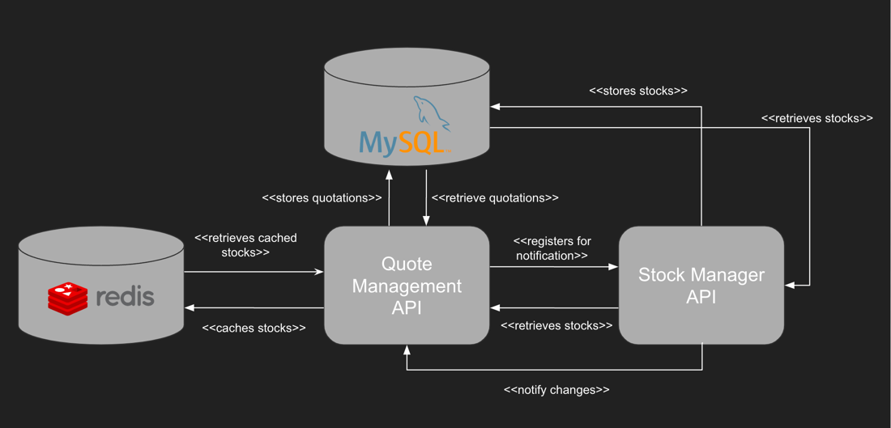

# Quotation-Management API

A back-end project to assess my skills and apply for a job at Inatel


## Domain
### Entities

The main entity of the application is the following one, representing a Quotation:
```json
{
    "id": "c01cede4-cd45-11eb-b8bc-0242ac130003",
    "stockId": "PETR3",
    "quotes":
    {
        "2019-01-01": "10",
        "2019-01-02": "11",
        "2019-01-03": "14"
    }
}
```

### Use Cases

#### Create Stock:
Using the payload described above, we should be able to create a quotation in the database.

#### Read Stocks:
The user should be able to retrieve all existing quotations from the database.

#### Read stocks by StockId:
The user should be able to retrieve existing quotations that have a given stockId.

## Data Providers
### MySQL
The system uses MySQL to store data of stocks and quotations.

### Redis
Redis is used as a cache for existing stocks from stock-manager

## Extra services
### stock-manager
API that manages existing stocks in the system. Used for validation if a stock exists before creating a quotation.

## Architecture


## How to run?
Build the project using:

```mvn clean package -DMYSQL_USERNAME=root -DMYSQL_PASSWORD=root```

After that, run the project using:

```docker-compose up --build```

Four containers will be built, where all of them will work together to make the application work properly:

- MySQL
- Redis
- stock-manager
- **quotation-management**

## How to use it?

### To create a stock:
Make a POST request, using the payload described at the beginning to the endpoint:

`http://{host}:8081/quotations`

### To read all stocks:
Make a GET request to:

`http://{host}:8081/quotations`

### To read all stocks that have a given stockId:
Make a GET request to:

`http://{host}:8081/quotations?stockId={stockId}`

Note: Fields that have curly brackets should be replaced by the actual value.
Like {host} running locally should be replaced by localhost.